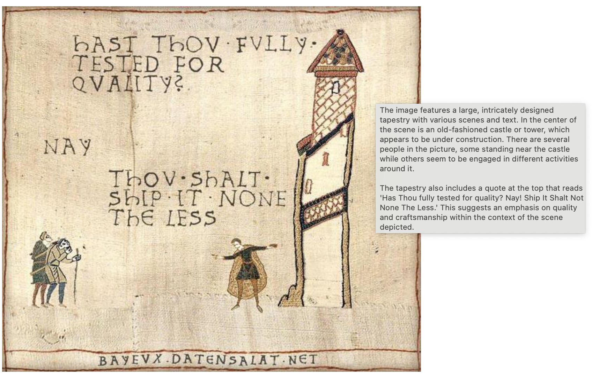

# Image alt text generator



This is a proof of concept browser extension to generate descriptive alt text for images that don't
have one, on any web page.

To make this possible, it does:

* Recursively traverse the DOM to find images and check their alt property
* Collect images that have missing or bad (<20 characters currently) alt text
* Convert these images to Base64 JPEGs
* Send them to a multi-modal (text + vision) model and ask it to describe the image
* Inject the detailed (usually 2 paragraphs) description back into the image alt property

Most of this is currently implemented in [source/content.js](./source/content.js).

In its current form it is not ready to be published as an extension, but there are many possible
directions to take it to:

* Move the UI into the browser bar rather than rendering the button on the content page
* Do the work in background worker threads (although the extension itself isn't doing that much)
* Possibly run the model in the browser using WebAssembly / WebGPU
* Use GPT-4V API once it's available to simplify usage
* Fully test with screen readers and implement keyboard shortcuts and other UX improvements
* Save the generated description into a database or file and upload somewhere to prevent the same image having to be redone by every visitor on a page

## 📹 Demo screencast

https://github.com/daaain/image-alt-text-generator-extension/assets/69962/b0fdf1a8-320f-480a-8f2a-1f603d738030

## 🌋 LLaVa model

For this extension to work, you need to have LLaVa 1.5 running in the Llama.cpp web server.

To set these up you can follow these steps on an Apple Silicon (M1/M2) Mac:

```sh
git clone https://github.com/ggerganov/llama.cpp.git
cd llama.cpp
make
curl -L https://huggingface.co/mys/ggml_llava-v1.5-7b/resolve/main/ggml-model-q5_k.gguf -o ggml-model-q5_k.gguf
curl -L https://huggingface.co/mys/ggml_llava-v1.5-7b/resolve/main/mmproj-model-f16.gguf -o mmproj-model-f16.gguf
./server -m ggml-model-q5_k.gguf --mmproj mmproj-model-f16.gguf -ngl 1
```

## 🛠 Development

1. Run `npm install` to install all required dependencies
1. Run `npm run all` to build with Parcel and watch for changes; run the Web-ext library to pack the
development extension and open it in Chromium; and to serve up the contents of `test_page`

## Credits

Browser extension template from [fregante/browser-extension-template](https://github.com/fregante/browser-extension-template)
